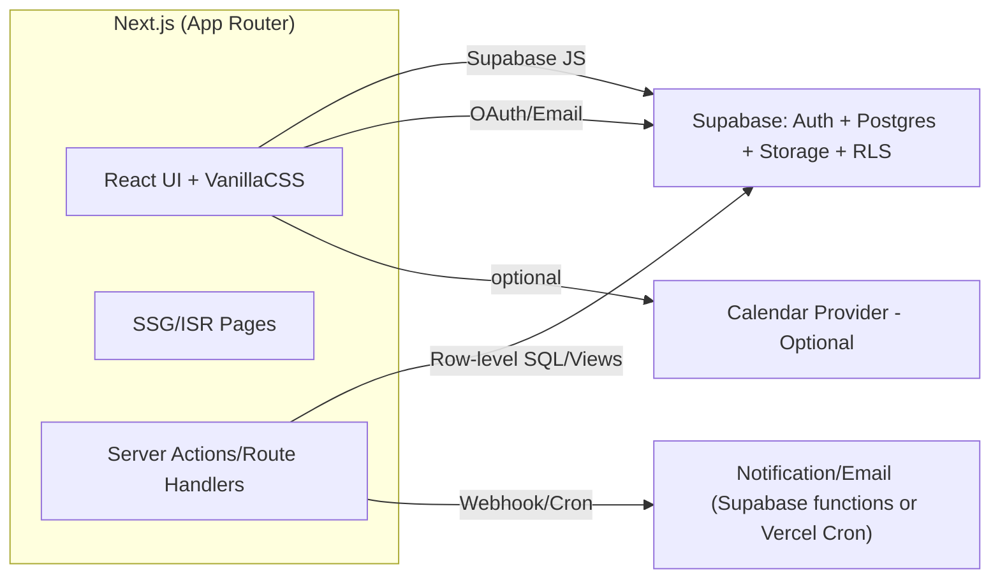

# Study Club Tracker

Next.js + Supabase 기반 스터디 진행 관리/커뮤니티 플랫폼입니다. 팀/개인별 목표 설정, 주차·일간 계획 수립, 진행률 관리, 팀 피드백 및 알림을 지원합니다.

## 핵심 기능

- [스터디 계획 수립]
  - 팀/개인별 학습 목표 등록
  - 주차별·일별 계획 관리
- [진행률 관리]
  - 개인 학습 진행률 입력
  - 팀 전체 진행 현황 시각화(그래프/퍼센트)
- [공유 및 피드백]
  - 팀원별 진행 현황 공개
  - 댓글/피드백, 격려/조언
- [알림 및 일정]
  - 마감일, 목표 진행률 미달 시 알림
  - 캘린더 연동(옵션)
- [대시보드]
  - 개인/팀 전체 진행 상황 한눈에 확인
  - 목표 달성률 비교
- [커뮤니티]
  - 참여 가능한 스터디 클럽 추천
  - 스터디 클럽 검색
- [계정]
  - Supabase Auth

## 기술 스택

- 프레임워크: Next.js 15 (App Router), React 19, TypeScript
- 데이터/인증: Supabase (Postgres, Row Level Security, Auth)
- 스타일: VanillaCSS + CSS Modules
- 품질도구: ESLint, Prettier
- 배포: Vercel
- 패키지: Node LTS, pnpm

---

## 아키텍처

### 개요

- 클라이언트: Next.js App Router 기반 서버 컴포넌트 + 클라이언트 컴포넌트 혼합
- 백엔드: Supabase(Postgres) + Row Level Security 정책. 인증/세션은 Supabase Auth
- 통신: Supabase JS 클라이언트, Edge-friendly 패턴 우선
- 배포: Vercel(환경변수로 Supabase 프로젝트 연결)

### 아키텍처 다이어그램



---

## 디렉토리 구조

```text
/
├─ app/
│  ├─ *.module.css
│  ├─ (marketing)/
│  │  └─ page.tsx
│  ├─ dashboard/
│  │  ├─ page.tsx
│  │  ├─ teams/[teamId]/page.tsx
│  │  ├─ goals/[goalId]/page.tsx
│  │  └─ clubs/page.tsx
│  ├─ api/
│  │  ├─ progress/route.ts
│  │  ├─ comments/route.ts
│  │  ├─ notifications/route.ts
│  │  └─ clubs/route.ts
│  └─ layout.tsx
├─ components/
│  ├─ charts/ProgressChart.tsx
│  ├─ cards/GoalCard.tsx
│  ├─ tables/TeamProgressTable.tsx
│  ├─ forms/GoalForm.tsx
│  ├─ forms/PlanForm.tsx
│  ├─ comments/CommentList.tsx
│  └─ ui/
├─ lib/
│  ├─ supabase/client.ts
│  ├─ supabase/server.ts
│  ├─ auth.ts
│  ├─ validators/
│  └─ utils.ts
├─ styles/
│  ├─ globals.css
│  └─ common/
│     ├─ reset.css
│     ├─ animation.css
│     ├─ a11y.css
│     └─ variable.css
├─ scripts/
├─ .eslintrc.cjs
├─ .prettierrc
├─ package.json / pnpm-lock.yaml
└─ README.md
```

---

## 데이터 모델 (ERD & 스키마)

### ERD

```mermaid
graph LR
%% Entities
USER["USER<br/>user_id: UUID PK<br/>provider: VARCHAR NN<br/>provider_id: VARCHAR NN<br/>email: VARCHAR UQ<br/>username: VARCHAR<br/>created_at: TIMESTAMP NN<br/>updated_at: TIMESTAMP NN"]
STUDYGOAL["STUDYGOAL<br/>goal_id: UUID PK<br/>owner_id: UUID FK(User.user_id)<br/>title: VARCHAR NN<br/>description: TEXT<br/>is_team: BOOLEAN NN<br/>start_date: DATE NN<br/>end_date: DATE NN<br/>created_at: TIMESTAMP NN<br/>updated_at: TIMESTAMP NN"]
PLAN["PLAN<br/>plan_id: UUID PK<br/>goal_id: UUID FK(StudyGoal.goal_id)<br/>user_id: UUID FK(User.user_id)<br/>plan_type: VARCHAR NN<br/>plan_start: DATE NN<br/>plan_end: DATE NN<br/>description: TEXT<br/>status: VARCHAR NN<br/>notification_sent: BOOLEAN NN<br/>created_at: TIMESTAMP NN<br/>updated_at: TIMESTAMP NN"]
REACTION["REACTION<br/>reaction_id: UUID PK<br/>user_id: UUID FK(User.user_id)<br/>plan_id: UUID FK(Plan.plan_id)<br/>emoji: VARCHAR NN<br/>created_at: TIMESTAMP NN"]
COMMUNITY["COMMUNITY<br/>club_id: UUID PK<br/>name: VARCHAR UQ NN<br/>description: TEXT<br/>is_public: BOOLEAN NN<br/>created_at: TIMESTAMP NN<br/>updated_at: TIMESTAMP NN"]
COMMUNITYMEMBER["COMMUNITYMEMBER<br/>club_id: UUID PK FK(Community.club_id)<br/>user_id: UUID PK FK(User.user_id)<br/>joined_at: TIMESTAMP NN"]

%% Relationships (labelsì— ê°œì²´/관계/기수성 기ì…)
USER -- "owns 1.._ StudyGoal" --> STUDYGOAL
STUDYGOAL -- "includes 1.._ Plan" --> PLAN
USER -- "assigned_to 0.._ Plan" --> PLAN
PLAN -- "receives 0.._ Reaction" --> REACTION
USER -- "reacts 0.._ Reaction" --> REACTION
COMMUNITY -- "has 0.._ CommunityMember" --> COMMUNITYMEMBER
USER -- "joins 0..\* CommunityMember" --> COMMUNITYMEMBER
```



### 데이터 스키마 테이블

#### User 테이블 (소셜 로그인 전용)

| 컬럼명      | 타입      | 제약조건          | 설명                                         |
| ----------- | --------- | ----------------- | -------------------------------------------- |
| user_id     | UUID      | PK                | 사용자 고유 ID                               |
| provider    | VARCHAR   | Not Null          | 소셜 로그인 공급자명 (예: 'kakao', 'google') |
| provider_id | VARCHAR   | Not Null          | 소셜 로그인 공급자에서 발급한 고유 사용자 ID |
| email       | VARCHAR   | Unique, Nullable  | 이메일 (소셜 공급자가 제공 시)               |
| username    | VARCHAR   | Nullable          | 사용자명 (필요 시)                           |
| created_at  | TIMESTAMP | Not Null, Default | 생성일                                       |
| updated_at  | TIMESTAMP | Not Null, Default | 수정일                                       |

#### StudyGoal 테이블

| 컬럼명      | 타입      | 제약조건                | 설명                            |
| ----------- | --------- | ----------------------- | ------------------------------- |
| goal_id     | UUID      | PK                      | 목표 고유 ID                    |
| owner_id    | UUID      | FK(User.user_id)        | 목표 소유자 (개인 또는 팀 리더) |
| title       | VARCHAR   | Not Null                | 목표명                          |
| description | TEXT      |                         | 목표 설명                       |
| is_team     | BOOLEAN   | Not Null, Default false | 팀 목표 여부                    |
| start_date  | DATE      | Not Null                | 목표 시작일                     |
| end_date    | DATE      | Not Null                | 목표 종료일                     |
| created_at  | TIMESTAMP | Not Null, Default       | 생성일                          |
| updated_at  | TIMESTAMP | Not Null, Default       | 수정일                          |

#### Plan 테이블

| 컬럼명            | 타입      | 제약조건                    | 설명                                              |
| ----------------- | --------- | --------------------------- | ------------------------------------------------- |
| plan_id           | UUID      | PK                          | 계획 고유 ID                                      |
| goal_id           | UUID      | FK(StudyGoal.goal_id)       | 연결된 목표 ID                                    |
| user_id           | UUID      | FK(User.user_id)            | 담당자 (팀원의 경우 개별 관리 가능)               |
| plan_type         | VARCHAR   | Not Null                    | 계획 유형 ('weekly', 'daily')                     |
| plan_start        | DATE      | Not Null                    | 계획 시작일                                       |
| plan_end          | DATE      | Not Null                    | 계획 종료일                                       |
| description       | TEXT      |                             | 계획 내용                                         |
| status            | VARCHAR   | Not Null, Default 'pending' | 진행 상태 ('pending', 'in_progress', 'completed') |
| notification_sent | BOOLEAN   | Not Null, Default false     | 알림 발송 여부                                    |
| created_at        | TIMESTAMP | Not Null, Default           | 생성일                                            |
| updated_at        | TIMESTAMP | Not Null, Default           | 수정일                                            |

#### Reaction 테이블

| 컬럼명      | 타입      | 제약조건          | 설명                               |
| ----------- | --------- | ----------------- | ---------------------------------- |
| reaction_id | UUID      | PK                | 리액션 고유 ID                     |
| user_id     | UUID      | FK(User.user_id)  | 반응 누른 사용자 ID                |
| plan_id     | UUID      | FK(Plan.plan_id)  | 대상 계획 ID                       |
| emoji       | VARCHAR   | Not Null          | 이모지 코드 또는 이름 (예: 👍, ❤️) |
| created_at  | TIMESTAMP | Not Null, Default | 반응 누른 시간                     |

#### Community 테이블

| 컬럼명      | 타입      | 제약조건               | 설명         |
| ----------- | --------- | ---------------------- | ------------ |
| club_id     | UUID      | PK                     | 클럽 고유 ID |
| name        | VARCHAR   | Not Null, Unique       | 클럽 이름    |
| description | TEXT      |                        | 클럽 소개    |
| is_public   | BOOLEAN   | Not Null, Default true | 공개 여부    |
| created_at  | TIMESTAMP | Not Null, Default      | 생성일       |
| updated_at  | TIMESTAMP | Not Null, Default      | 수정일       |

#### CommunityMember 테이블

| 컬럼명    | 타입      | 제약조건                  | 설명         |
| --------- | --------- | ------------------------- | ------------ |
| club_id   | UUID      | FK(Community.club_id), PK | 소속 클럽 ID |
| user_id   | UUID      | FK(User.user_id), PK      | 회원 ID      |
| joined_at | TIMESTAMP | Not Null                  | 가입일       |

---

## 주요 사용자 플로우

- [온보딩/로그인]
  - 이메일/비번 또는 OAuth → 세션 획득 → `dashboard` 이동
- [목표/계획]
  - 개인/팀 목표 생성 → 기간/단위 설정 → 일간 계획 등록
- [진행률 입력]
  - 일별 학습량 기록 → 목표 대비 누적/일별 그래프 갱신
  - 팀 대시보드에서 멤버별 진행률 비교 → 댓글/격려
- [알림]
  - 미입력/마감 임박/저조 알림 생성
- [커뮤니티]
  - 클럽 검색/추천 → 가입 → 팀/목표 연결(옵션)

---

## 기능별 개발 스코프 및 계획(간략)

- [MVP]
  - Auth: Supabase 이메일 로그인
  - 목표/계획: `study_goals`, `plans` CRUD
  - 진행률: `progress_entries` 작성, 개인 대시보드(누적/일간 그래프)
  - 팀: `teams`, `team_members` CRUD, 팀 대시보드
  - 피드백: `comments` 목록/생성
  - 알림(기본): 저조/마감 임박 계산(크론/서버 액션)

---

## API/페이지 설계(요약)

- Pages
  - `/dashboard`
  - `/dashboard/teams/[teamId]`
  - `/dashboard/goals/[goalId]`
  - `/dashboard/clubs`
- API(Route Handlers)
  - `POST /api/progress`
  - `GET/POST /api/comments`
  - `GET/POST /api/notifications`
  - `GET /api/clubs`

---

## 로컬 개발 가이드

### 사전 준비

- Node LTS, pnpm 설치
- Supabase 프로젝트 생성 및 환경변수
  - `NEXT_PUBLIC_SUPABASE_URL`
  - `NEXT_PUBLIC_SUPABASE_ANON_KEY`
  - `SUPABASE_SERVICE_ROLE_KEY`

### 설치 및 실행

```bash
pnpm install
pnpm dev
```

### 스크립트(예시)

```json
{
  "scripts": {
    "dev": "next dev",
    "build": "next build",
    "start": "next start",
    "lint": "eslint . --ext .ts,.tsx",
    "format": "prettier --write .",
    "typecheck": "tsc --noEmit"
  }
}
```

### 스타일

- 전역 스타일은 `app/layout.tsx`에서 `app/globals.css`를 임포트
- `*.module.css`로 컴포넌트 스타일링

### ESLint/Prettier/CI

- `eslint.config.mjs` Flat Config 기반 설정
- GitHub Actions `.github/workflows/ci.yml`에서 `pnpm lint`, `pnpm typecheck` 자동 실행
- `pnpm format`으로 Prettier 적용

---

## 배포

- Vercel Git 연동 → Project 생성
- 환경변수 설정
  - `NEXT_PUBLIC_SUPABASE_URL`
  - `NEXT_PUBLIC_SUPABASE_ANON_KEY`
- 빌드: 프레임워크 `Next.js`, 루트 `/`
- Supabase RLS/Seed 적용

---

## 보안/개인정보 고려

- RLS로 목표/댓글/진행률 접근 제어
- 서비스 롤 키는 서버 전용
- 최소수집·필요시 익명화

---

## 향후 로드맵

- 모바일 최적화
- 파일 업로드(학습 인증) + Storage
- 고급 추천/리마인더
- 외부 캘린더 양방향 동기화

---

## 로컬 확인

- 앱: <http://localhost:3000/>
- 헬스체크: <http://localhost:3000/api/health>

```

```
