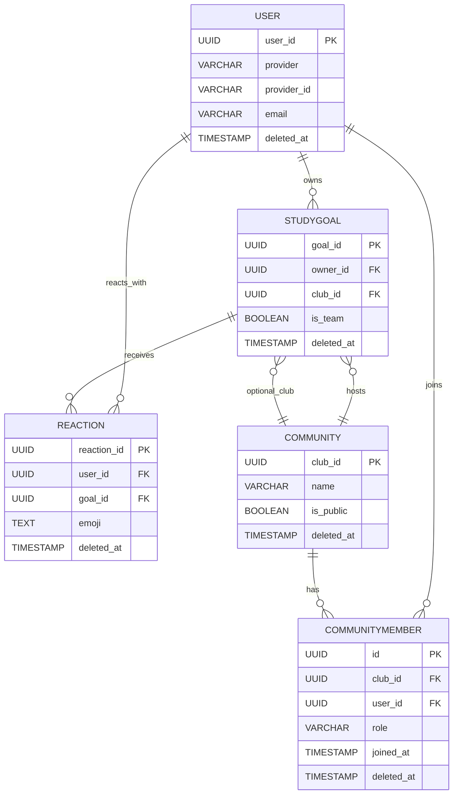

# 데이터 모델 (ERD & 스키마)

## ERD



## 데이터 스키마 테이블
### User 테이블 (소셜 로그인 전용)

| 컬럼명      | 타입      | 제약조건                | 설명                                         |
| ----------- | --------- | ----------------------- | -------------------------------------------- |
| user_id     | uuid      | PK, DEFAULT auth.uid()  | 사용자 고유 ID                               |
| provider    | varchar   | NOT NULL                | 소셜 로그인 공급자명 (예: 'kakao', 'google') |
| provider_id | varchar   | NOT NULL                | 공급자에서 발급한 고유 사용자 ID             |
| email       | varchar   | UNIQUE, NULL            | 이메일 (소셜 공급자가 제공 시)               |
| username    | varchar   | NOT NULL                | 사용자명                                     |
| nickname    | varchar   | NULL                    | 표시 이름(선택)                               |
| created_at  | timestamp | NOT NULL, DEFAULT now() | 생성일                                       |
| updated_at  | timestamp | NOT NULL, DEFAULT now() | 수정일 (트리거로 자동 업데이스트)              |
| deleted_at  | timestamp | NULL                    | 소프트 삭제 시각                             |

#### 제약조건 - User 테이블

> 활성 사용자(soft-delete 되지 않은 행)에 한해 고유성을 보장합니다. 소프트 삭제 후 동일 식별자로 재가입을 허용합니다.

```sql
-- 활성 행만 유일
CREATE UNIQUE INDEX uk_user_provider_active ON users (provider, provider_id)
  WHERE deleted_at IS NULL;
CREATE UNIQUE INDEX uk_user_email_active ON users (email)
  WHERE deleted_at IS NULL;
CREATE UNIQUE INDEX uk_user_username_active ON users (username)
  WHERE deleted_at IS NULL;
```

#### 인덱스 - User 테이블

> 로그인 공급자와 이메일 기반 검색을 가속하고 활성 사용자만 필터링할 수 있도록 합니다.

```sql
CREATE INDEX idx_user_provider ON users (provider, provider_id);
CREATE INDEX idx_user_email ON users (email);
CREATE INDEX idx_user_active ON users (user_id) WHERE deleted_at IS NULL;
```

### StudyGoal 테이블

| 컬럼명      | 타입      | 제약조건                     | 설명                             |
| ----------- | --------- | ---------------------------- | -------------------------------- |
| goal_id     | uuid      | PK DEFAULT gen_random_uuid() | 목표 고유 ID                     |
| owner_id    | uuid      | NOT NULL, FK(User.user_id)   | 목표 소유자 (개인 또는 팀 리더)  |
| club_id     | uuid      | NULL, FK(Community.club_id)  | 연결된 커뮤니티 (팀 목표인 경우) |
| title       | varchar   | NOT NULL                     | 목표명                           |
| description | text      | NULL                         | 목표 설명                        |
| is_team     | boolean   | NOT NULL, DEFAULT false      | 팀 목표 여부                     |
| start_date  | date      | NOT NULL                     | 목표 시작일                      |
| end_date    | date      | NOT NULL                     | 목표 종료일                      |
| created_at  | timestamp | NOT NULL, DEFAULT now()      | 생성일                           |
| updated_at  | timestamp | NOT NULL, DEFAULT now()      | 수정일 (트리거로 자동 업데이트)  |
| deleted_at  | timestamp | NULL                         | 소프트 삭제 시각                 |

#### 제약조건 - StudyGoal 테이블

> 기간 검증과 팀 목표 설정을 강제하고 커뮤니티 삭제 시 목표 연결 상태를 정의합니다.

```sql
CONSTRAINT chk_goal_dates CHECK (end_date >= start_date)
CONSTRAINT fk_goal_owner FOREIGN KEY (owner_id) REFERENCES users(user_id) ON DELETE CASCADE
CONSTRAINT fk_goal_club FOREIGN KEY (club_id) REFERENCES communities(club_id) ON DELETE SET NULL
CONSTRAINT chk_team_goal_club CHECK (
    (is_team = false AND club_id IS NULL) OR
    (is_team = true AND club_id IS NOT NULL)
)
```

#### 인덱스 - StudyGoal 테이블

> 소유자·기간·팀 여부별 조회를 빠르게 처리하고 삭제되지 않은 목표만 효율적으로 제공합니다.

```sql
CREATE INDEX idx_goal_owner ON study_goals (owner_id);
CREATE INDEX idx_goal_dates ON study_goals (start_date, end_date);
CREATE INDEX idx_goal_team ON study_goals (is_team);
CREATE INDEX idx_goal_owner_team ON study_goals (owner_id, is_team)
    WHERE deleted_at IS NULL;
CREATE INDEX idx_goal_active ON study_goals (owner_id)
    WHERE deleted_at IS NULL;
```

### Reaction 테이블

| 컬럼명      | 타입      | 제약조건                          | 설명                               |
| ----------- | --------- | --------------------------------- | ---------------------------------- |
| reaction_id | uuid      | PK DEFAULT gen_random_uuid()      | 리액션 고유 ID                     |
| user_id     | uuid      | NOT NULL, FK(users.user_id)       | 반응 누른 사용자 ID                |
| goal_id     | uuid      | NOT NULL, FK(study_goals.goal_id) | 대상 목표 ID                       |
| emoji       | text      | NOT NULL                          | 이모지 코드 또는 이름 (예: 👍, ❤️) |
| created_at  | timestamp | NOT NULL, DEFAULT now()           | 반응 누른 시간                     |
| deleted_at  | timestamp | NULL                              | 소프트 삭제 시각                   |

#### 제약조건 - Reaction 테이블

> 사용자·목표 연결 무결성을 보장하고 사용자별 동일 이모지 중복 입력을 제한합니다.

```sql
CONSTRAINT uk_reaction_user_goal UNIQUE (user_id, goal_id, emoji)
CONSTRAINT fk_reaction_user FOREIGN KEY (user_id) REFERENCES users(user_id) ON DELETE CASCADE
CONSTRAINT fk_reaction_goal FOREIGN KEY (goal_id) REFERENCES study_goals(goal_id) ON DELETE CASCADE
```

#### 인덱스 - Reaction 테이블

> 반응을 목표 또는 사용자 기준으로 집계하고 활성 반응만 효율적으로 조회합니다.

```sql
CREATE INDEX idx_reaction_goal ON reactions (goal_id);
CREATE INDEX idx_reaction_user ON reactions (user_id);
CREATE INDEX idx_reaction_active ON reactions (goal_id)
    WHERE deleted_at IS NULL;
```

### Community 테이블

| 컬럼명      | 타입      | 제약조건                     | 설명                            |
| ----------- | --------- | ---------------------------- | ------------------------------- |
| club_id     | uuid      | PK DEFAULT gen_random_uuid() | 클럽 고유 ID                    |
| name        | varchar   | NOT NULL, UNIQUE             | 클럽 이름                       |
| description | text      | NULL                         | 클럽 소개                       |
| is_public   | boolean   | NOT NULL, DEFAULT true       | 공개 여부                       |
| created_at  | timestamp | NOT NULL, DEFAULT now()      | 생성일                          |
| updated_at  | timestamp | NOT NULL, DEFAULT now()      | 수정일 (트리거로 자동 업데이트) |
| deleted_at  | timestamp | NULL                         | 소프트 삭제 시각                |

#### 제약조건 - Community 테이블

> 활성 커뮤니티(soft-delete 되지 않은 행)에 한해 이름의 고유성을 보장합니다. 소프트 삭제된 커뮤니티 이름은 재사용할 수 있습니다. (Prisma 스키마로 직접 표현 불가, 마이그레이션 SQL로 관리)

```sql
CREATE UNIQUE INDEX uk_community_name_active ON communities (name)
  WHERE deleted_at IS NULL;
```

#### 인덱스 - Community 테이블

> 공개 여부와 이름 검색, 활성 커뮤니티 조회를 빠르게 처리합니다.

```sql
CREATE INDEX idx_community_public ON communities (is_public);
CREATE INDEX idx_community_name ON communities (name);
CREATE INDEX idx_community_active ON communities (name)
    WHERE deleted_at IS NULL;
```

### CommunityMember 테이블

| 컬럼명     | 타입      | 제약조건                          | 설명                     |
| ---------- | --------- | --------------------------------- | ------------------------ |
| id         | uuid      | PK DEFAULT gen_random_uuid()      | 회원 고유 ID             |
| club_id    | uuid      | NOT NULL, FK(communities.club_id) | 소속 클럽 ID             |
| user_id    | uuid      | NOT NULL, FK(users.user_id)       | 회원 ID                  |
| role       | varchar   | NOT NULL, DEFAULT 'member'        | 역할 ('admin', 'member') |
| joined_at  | timestamp | NOT NULL, DEFAULT now()           | 가입일                   |
| deleted_at | timestamp | NULL                              | 소프트 삭제 시각         |

#### 제약조건 - CommunityMember 테이블

> 단일 PK와 FK로 가입 관계를 보존하고 역할 값 범위를 제한합니다.

```sql
CONSTRAINT pk_community_member PRIMARY KEY (id)
CONSTRAINT fk_member_club FOREIGN KEY (club_id) REFERENCES communities(club_id) ON DELETE CASCADE
CONSTRAINT fk_member_user FOREIGN KEY (user_id) REFERENCES users(user_id) ON DELETE CASCADE
CONSTRAINT chk_member_role CHECK (role IN ('admin', 'member'))
```

#### 인덱스/유니크 - CommunityMember 테이블

> 활성 구성원에 대해 (club_id, user_id)의 유일성을 보장하기 위해 부분 유니크 인덱스를 사용합니다. (Prisma 스키마에서는 직접 표현 불가, 마이그레이션 SQL로 관리)

```sql
CREATE INDEX idx_member_user ON community_members (user_id);
CREATE INDEX idx_member_club ON community_members (club_id);
CREATE INDEX idx_member_active ON community_members (club_id)
    WHERE deleted_at IS NULL;
CREATE UNIQUE INDEX uk_member_active ON community_members (club_id, user_id)
    WHERE deleted_at IS NULL;
```
