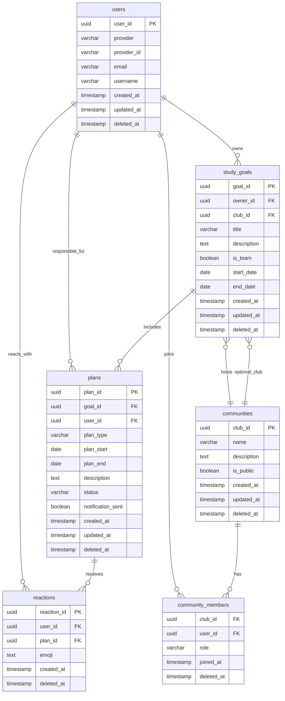

# 데이터 모델 (ERD & 스키마)

## ERD



## 데이터 스키마 테이블

### users 테이블 (소셜 로그인 전용)

| 컬럼명      | 타입          | 제약조건                | 설명                                         |
| ----------- | ------------- | ----------------------- | -------------------------------------------- |
| user_id     | uuid          | PK, DEFAULT auth.uid()  | 사용자 고유 ID                               |
| provider    | varchar       | NOT NULL                | 소셜 로그인 공급자명 (예: 'kakao', 'google') |
| provider_id | varchar       | NOT NULL                | 공급자에서 발급한 고유 사용자 ID             |
| email       | varchar       | UNIQUE, NULL            | 이메일 (소셜 공급자가 제공 시)               |
| username    | varchar       | NOT NULL                | 사용자명                                     |
| created_at  | timestamp     | NOT NULL, DEFAULT now() | 생성일                                       |
| updated_at  | timestamp     | NOT NULL, DEFAULT now() | 수정일 (트리거로 자동 업데이트)              |
| deleted_at  | timestamp     | NULL                    | 소프트 삭제 시각                             |

#### 제약조건 - users 테이블

> `uk_user_provider`와 `uk_user_email` 제약은 공급자 계정과 이메일의 중복 생성을 차단합니다.

```sql
CONSTRAINT uk_user_provider UNIQUE (provider, provider_id)
CONSTRAINT uk_user_email UNIQUE (email)
```

#### 인덱스 - users 테이블

> 로그인 공급자와 이메일 기반 검색을 가속하고 활성 사용자만 필터링할 수 있도록 합니다.

```sql
CREATE INDEX idx_user_provider ON users (provider, provider_id);
CREATE INDEX idx_user_email ON users (email);
CREATE INDEX idx_user_active ON users (user_id) WHERE deleted_at IS NULL;
```

### study_goals 테이블

| 컬럼명      | 타입          | 제약조건                     | 설명                             |
| ----------- | ------------- | ---------------------------- | ------------------------------- |
| goal_id     | uuid          | PK DEFAULT gen_random_uuid() | 목표 고유 ID                     |
| owner_id    | uuid          | NOT NULL, FK(users.user_id)   | 목표 소유자 (개인 또는 팀 리더)  |
| club_id     | uuid          | NULL, FK(communities.club_id)  | 연결된 커뮤니티 (팀 목표인 경우) |
| title       | varchar       | NOT NULL                     | 목표명                           |
| description | text          | NULL                         | 목표 설명                        |
| is_team     | boolean       | NOT NULL, DEFAULT false      | 팀 목표 여부                     |
| start_date  | date          | NOT NULL                     | 목표 시작일                      |
| end_date    | date          | NOT NULL                     | 목표 종료일                      |
| created_at  | timestamp     | NOT NULL, DEFAULT now()      | 생성일                           |
| updated_at  | timestamp     | NOT NULL, DEFAULT now()      | 수정일 (트리거로 자동 업데이트)  |
| deleted_at  | timestamp     | NULL                         | 소프트 삭제 시각                 |

#### 제약조건 - study_goals 테이블

> 기간 검증과 팀 목표 설정을 강제하고 커뮤니티 삭제 시 목표 연결 상태를 정의합니다.

```sql
CONSTRAINT chk_goal_dates CHECK (end_date >= start_date)
CONSTRAINT fk_goal_owner FOREIGN KEY (owner_id) REFERENCES users(user_id) ON DELETE CASCADE
CONSTRAINT fk_goal_club FOREIGN KEY (club_id) REFERENCES communities(club_id) ON DELETE SET NULL
CONSTRAINT chk_team_goal_club CHECK (
    (is_team = false AND club_id IS NULL) OR 
    (is_team = true AND club_id IS NOT NULL)
)
```

#### 인덱스 - study_goals 테이블

> 소유자·기간·팀 여부별 조회를 빠르게 처리하고 삭제되지 않은 목표만 효율적으로 제공합니다.

```sql
CREATE INDEX idx_goal_owner ON study_goals (owner_id);
CREATE INDEX idx_goal_dates ON study_goals (start_date, end_date);
CREATE INDEX idx_goal_team ON study_goals (is_team);
CREATE INDEX idx_goal_owner_team ON study_goals (owner_id, is_team)
    WHERE deleted_at IS NULL;
CREATE INDEX idx_goal_active ON study_goals (owner_id)
    WHERE deleted_at IS NULL;
```

### plans 테이블

| 컬럼명            | 타입          | 제약조건                       | 설명                                              |
| ----------------- | ------------- | ------------------------------ | ------------------------------------------------- |
| plan_id           | uuid          | PK DEFAULT gen_random_uuid()   | 계획 고유 ID                                      |
| goal_id           | uuid          | FK(study_goals.goal_id) NOT NULL | 연결된 목표 ID                                    |
| user_id           | uuid          | FK(users.user_id) NOT NULL      | 담당자 (팀원의 경우 개별 관리 가능)               |
| plan_type         | varchar       | NOT NULL                       | 계획 유형 ('weekly', 'daily')                     |
| plan_start        | date          | NOT NULL                       | 계획 시작일                                       |
| plan_end          | date          | NOT NULL                       | 계획 종료일                                       |
| description       | text          | NULL                           | 계획 내용                                         |
| status            | varchar       | NOT NULL, DEFAULT 'pending'    | 진행 상태 ('pending', 'in_progress', 'completed') |
| notification_sent | boolean       | NOT NULL, DEFAULT false        | 알림 발송 여부                                    |
| created_at        | timestamp     | NOT NULL, DEFAULT now()        | 생성일                                            |
| updated_at        | timestamp     | NOT NULL, DEFAULT now()        | 수정일 (트리거로 자동 업데이트)                   |
| deleted_at        | timestamp     | NULL                           | 소프트 삭제 시각                                   |

#### 제약조건 - plans 테이블

> 계획 기간과 유형, 상태 값을 검증하고 연관 목표·사용자 삭제 시 연쇄 동작을 정의합니다.

```sql
CONSTRAINT chk_plan_dates CHECK (plan_end >= plan_start)
CONSTRAINT chk_plan_type CHECK (plan_type IN ('weekly', 'daily'))
CONSTRAINT chk_plan_status CHECK (status IN ('pending', 'in_progress', 'completed'))
CONSTRAINT fk_plan_goal FOREIGN KEY (goal_id) REFERENCES study_goals(goal_id) ON DELETE CASCADE
CONSTRAINT fk_plan_user FOREIGN KEY (user_id) REFERENCES users(user_id) ON DELETE CASCADE
```

#### 인덱스 - plans 테이블

> 기본 인덱스는 목표, 담당자, 기간, 상태 기준 조회를 가속화합니다.
> 부분 유니크 인덱스는 소프트 삭제된 계획을 제외하고 기간 중복 생성을 차단합니다.
> 부분 보조 인덱스는 활성 계획과 상태 기반 조회를 최적화합니다.

```sql
CREATE INDEX idx_plan_goal ON plans (goal_id);
CREATE INDEX idx_plan_user ON plans (user_id);
CREATE INDEX idx_plan_dates ON plans (plan_start, plan_end);
CREATE INDEX idx_plan_status ON plans (status);
CREATE UNIQUE INDEX idx_plan_user_goal_period ON plans (user_id, goal_id, plan_start, plan_end)
    WHERE deleted_at IS NULL;
CREATE INDEX idx_plan_user_status ON plans (user_id, status)
    WHERE deleted_at IS NULL;
CREATE INDEX idx_plan_active ON plans (goal_id)
    WHERE deleted_at IS NULL;
```

### reactions 테이블

| 컬럼명      | 타입          | 제약조건                     | 설명                                |
| ----------- | ------------- | ---------------------------- | ---------------------------------- |
| reaction_id | uuid          | PK DEFAULT gen_random_uuid() | 리액션 고유 ID                      |
| user_id     | uuid          | NOT NULL, FK(users.user_id)  | 반응 누른 사용자 ID                 |
| plan_id     | uuid          | NOT NULL, FK(plans.plan_id)  | 대상 계획 ID                        |
| emoji       | text          | NOT NULL                     | 이모지 코드 또는 이름 (예: 👍, ❤️) |
| created_at  | timestamp     | NOT NULL, DEFAULT now()      | 반응 누른 시간                      |
| deleted_at  | timestamp     | NULL                         | 소프트 삭제 시각                    |

#### 제약조건 - reactions 테이블

> 사용자·계획 연결 무결성을 보장하고 사용자별 동일 이모지 중복 입력을 제한합니다.

```sql
CONSTRAINT uk_reaction_user_plan UNIQUE (user_id, plan_id, emoji)
CONSTRAINT fk_reaction_user FOREIGN KEY (user_id) REFERENCES users(user_id) ON DELETE CASCADE
CONSTRAINT fk_reaction_plan FOREIGN KEY (plan_id) REFERENCES plans(plan_id) ON DELETE CASCADE
```

#### 인덱스 - reactions 테이블

> 반응을 계획 또는 사용자 기준으로 집계하고 활성 반응만 효율적으로 조회합니다.

```sql
CREATE INDEX idx_reaction_plan ON reactions (plan_id);
CREATE INDEX idx_reaction_user ON reactions (user_id);
CREATE INDEX idx_reaction_active ON reactions (plan_id)
    WHERE deleted_at IS NULL;
```

### communities 테이블

| 컬럼명      | 타입          | 제약조건                     | 설명                            |
| ----------- | ------------- | ---------------------------- | ------------------------------- |
| club_id     | uuid          | PK DEFAULT gen_random_uuid() | 클럽 고유 ID                    |
| name        | varchar       | NOT NULL, UNIQUE             | 클럽 이름                       |
| description | text          | NULL                         | 클럽 소개                       |
| is_public   | boolean       | NOT NULL, DEFAULT true       | 공개 여부                       |
| created_at  | timestamp     | NOT NULL, DEFAULT now()      | 생성일                          |
| updated_at  | timestamp     | NOT NULL, DEFAULT now()      | 수정일 (트리거로 자동 업데이트) |
| deleted_at  | timestamp     | NULL                         | 소프트 삭제 시각                |

#### 제약조건 - communities 테이블

> 커뮤니티 이름이 중복되지 않도록 강제하여 고유성을 보장합니다.

```sql
CONSTRAINT uk_community_name UNIQUE (name)
```

#### 인덱스 - communities 테이블

> 공개 여부와 이름 검색, 활성 커뮤니티 조회를 빠르게 처리합니다.

```sql
CREATE INDEX idx_community_public ON communities (is_public);
CREATE INDEX idx_community_name ON communities (name);
CREATE INDEX idx_community_active ON communities (name)
    WHERE deleted_at IS NULL;
```

### community_members 테이블

| 컬럼명    | 타입          | 제약조건                           | 설명                     |
| --------- | ------------- | ---------------------------------- | ------------------------ |
| club_id   | uuid          | NOT NULL, FK(communities.club_id)  | 소속 클럽 ID             |
| user_id   | uuid          | NOT NULL, FK(users.user_id)        | 회원 ID                  |
| role      | varchar       | NOT NULL, DEFAULT 'member'         | 역할 ('admin', 'member') |
| joined_at | timestamp     | NOT NULL, DEFAULT now()            | 가입일                   |
| deleted_at| timestamp     | NULL                               | 소프트 삭제 시각         |

#### 제약조건 - community_members 테이블

> 복합 PK와 FK로 가입 관계를 보존하고 역할 값 범위를 제한합니다.

```sql
CONSTRAINT pk_community_member PRIMARY KEY (club_id, user_id)
CONSTRAINT fk_member_club FOREIGN KEY (club_id) REFERENCES communities(club_id) ON DELETE CASCADE
CONSTRAINT fk_member_user FOREIGN KEY (user_id) REFERENCES users(user_id) ON DELETE CASCADE
CONSTRAINT chk_member_role CHECK (role IN ('admin', 'member'))
```

#### 인덱스 - community_members 테이블

> 회원이나 클럽 기준으로 활성 구성원을 빠르게 조회할 수 있도록 합니다.

```sql
CREATE INDEX idx_member_user ON community_members (user_id);
CREATE INDEX idx_member_club ON community_members (club_id);
CREATE INDEX idx_member_active ON community_members (club_id)
    WHERE deleted_at IS NULL;
```
