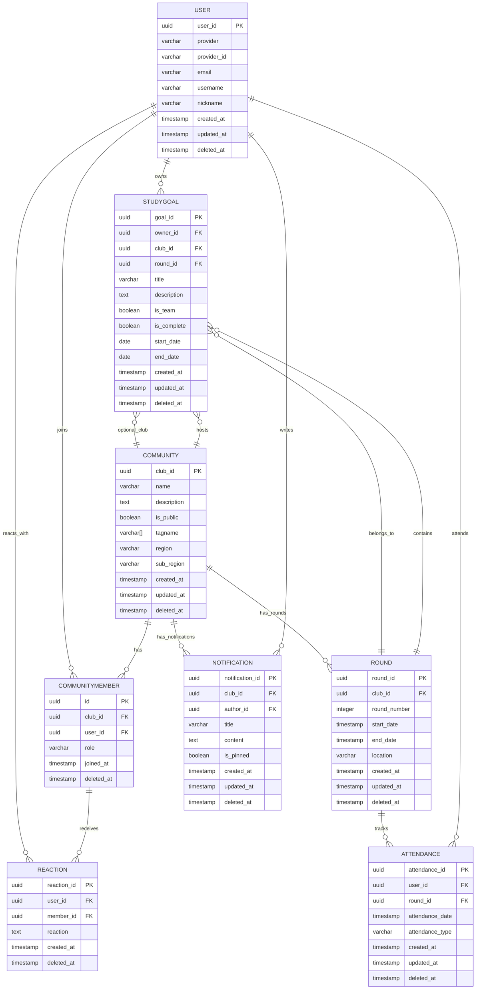

# 데이터 모델 (ERD & 스키마)

## ERD



## 데이터 스키마 테이블

### User 테이블 (소셜 로그인 전용)

| 컬럼명      | 타입      | 제약조건                | 설명                                         |
| ----------- | --------- | ----------------------- | -------------------------------------------- |
| user_id     | uuid      | PK, DEFAULT auth.uid()  | 사용자 고유 ID                               |
| provider    | varchar   | NOT NULL                | 소셜 로그인 공급자명 (예: 'kakao', 'google') |
| provider_id | varchar   | NOT NULL                | 공급자에서 발급한 고유 사용자 ID             |
| email       | varchar   | UNIQUE, NULL            | 이메일 (소셜 공급자가 제공 시)               |
| username    | varchar   | NOT NULL                | 사용자명                                     |
| nickname    | varchar   | NULL                    | 표시 이름(선택)                              |
| created_at  | timestamp | NOT NULL, DEFAULT now() | 생성일                                       |
| updated_at  | timestamp | NOT NULL, DEFAULT now() | 수정일 (트리거로 자동 업데이스트)            |
| deleted_at  | timestamp | NULL                    | 소프트 삭제 시각                             |

#### 제약조건 - User 테이블

> 활성 사용자(soft-delete 되지 않은 행)에 한해 고유성을 보장합니다. 소프트 삭제 후 동일 식별자로 재가입을 허용합니다.

```sql
-- 활성 행만 유일
CREATE UNIQUE INDEX uk_user_provider_active ON users (provider, provider_id)
  WHERE deleted_at IS NULL;
CREATE UNIQUE INDEX uk_user_email_active ON users (email)
  WHERE deleted_at IS NULL;
CREATE UNIQUE INDEX uk_user_username_active ON users (username)
  WHERE deleted_at IS NULL;
```

#### 인덱스 - User 테이블

> 로그인 공급자와 이메일 기반 검색을 가속하고 활성 사용자만 필터링할 수 있도록 합니다.

```sql
CREATE INDEX idx_user_provider ON users (provider, provider_id);
CREATE INDEX idx_user_email ON users (email);
CREATE INDEX idx_user_active ON users (user_id) WHERE deleted_at IS NULL;
```

### StudyGoal 테이블

| 컬럼명      | 타입      | 제약조건                     | 설명                             |
| ----------- | --------- | ---------------------------- | -------------------------------- |
| goal_id     | uuid      | PK DEFAULT gen_random_uuid() | 목표 고유 ID                     |
| owner_id    | uuid      | NOT NULL, FK(User.user_id)   | 목표 소유자 (개인 또는 팀 리더)  |
| club_id     | uuid      | NULL, FK(Community.club_id)  | 연결된 커뮤니티 (팀 목표인 경우) |
| round_id    | uuid      | NULL, FK(Round.round_id)     | 소속 회차 ID (선택적)            |
| title       | varchar   | NOT NULL                     | 목표명                           |
| description | text      | NULL                         | 목표 설명                        |
| is_team     | boolean   | NOT NULL, DEFAULT false      | 팀 목표 여부                     |
| is_complete | boolean   | NOT NULL, DEFAULT false      | 목표 완료 여부                   |
| start_date  | date      | NOT NULL                     | 목표 시작일                      |
| end_date    | date      | NOT NULL                     | 목표 종료일                      |
| created_at  | timestamp | NOT NULL, DEFAULT now()      | 생성일                           |
| updated_at  | timestamp | NOT NULL, DEFAULT now()      | 수정일 (트리거로 자동 업데이트)  |
| deleted_at  | timestamp | NULL                         | 소프트 삭제 시각                 |

#### 제약조건 - StudyGoal 테이블

> 기간 검증과 팀 목표 설정을 강제하고 커뮤니티 삭제 시 목표 연결 상태를 정의합니다.

```sql
CONSTRAINT chk_goal_dates CHECK (end_date >= start_date)
CONSTRAINT fk_goal_owner FOREIGN KEY (owner_id) REFERENCES users(user_id) ON DELETE CASCADE
CONSTRAINT fk_goal_club FOREIGN KEY (club_id) REFERENCES communities(club_id) ON DELETE SET NULL
CONSTRAINT fk_goal_round FOREIGN KEY (round_id) REFERENCES rounds(round_id) ON DELETE SET NULL
CONSTRAINT chk_team_goal_club CHECK (
    (is_team = false AND club_id IS NULL) OR
    (is_team = true AND club_id IS NOT NULL)
)
```

#### 인덱스 - StudyGoal 테이블

> 소유자·기간·팀 여부·커뮤니티·라운드·완료 상태별 조회를 빠르게 처리하고 삭제되지 않은 목표만 효율적으로 제공합니다.

```sql
CREATE INDEX idx_goal_owner ON study_goals (owner_id);
CREATE INDEX idx_goal_dates ON study_goals (start_date, end_date);
CREATE INDEX idx_goal_team ON study_goals (is_team);
CREATE INDEX idx_goal_round ON study_goals (round_id);
CREATE INDEX idx_goal_complete ON study_goals (is_complete);
CREATE INDEX idx_goal_club ON study_goals (club_id);
CREATE INDEX idx_goal_owner_team ON study_goals (owner_id, is_team)
    WHERE deleted_at IS NULL;
CREATE INDEX idx_goal_active ON study_goals (owner_id)
    WHERE deleted_at IS NULL;
```

### Reaction 테이블

| 컬럼명      | 타입      | 제약조건                           | 설명                           |
| ----------- | --------- | ---------------------------------- | ------------------------------ |
| reaction_id | uuid      | PK DEFAULT gen_random_uuid()       | 리액션 고유 ID                 |
| user_id     | uuid      | NOT NULL, FK(users.user_id)        | 반응 누른 사용자 ID            |
| member_id   | uuid      | NOT NULL, FK(community_members.id) | 대상 멤버 ID                   |
| reaction    | text      | NOT NULL                           | 리액션 내용 (이모지 또는 댓글) |
| created_at  | timestamp | NOT NULL, DEFAULT now()            | 반응 누른 시간                 |
| deleted_at  | timestamp | NULL                               | 소프트 삭제 시각               |

#### 제약조건 - Reaction 테이블

> 사용자와 멤버 간 연결 무결성을 보장합니다. 같은 사용자가 같은 멤버에게 여러 댓글을 남길 수 있도록 unique 제약조건은 없습니다.

```sql
CONSTRAINT fk_reaction_user FOREIGN KEY (user_id) REFERENCES users(user_id) ON DELETE CASCADE
CONSTRAINT fk_reaction_member FOREIGN KEY (member_id) REFERENCES community_members(id) ON DELETE CASCADE
```

#### 인덱스 - Reaction 테이블

> 반응을 멤버 또는 사용자 기준으로 집계하고 활성 반응만 효율적으로 조회합니다.

```sql
CREATE INDEX idx_reaction_member ON reactions (member_id);
CREATE INDEX idx_reaction_user ON reactions (user_id);
CREATE INDEX idx_reaction_active ON reactions (member_id)
    WHERE deleted_at IS NULL;
```

### Community 테이블

| 컬럼명      | 타입      | 제약조건                     | 설명                            |
| ----------- | --------- | ---------------------------- | ------------------------------- |
| club_id     | uuid      | PK DEFAULT gen_random_uuid() | 클럽 고유 ID                    |
| name        | varchar   | NOT NULL, UNIQUE             | 클럽 이름                       |
| description | text      | NULL                         | 클럽 소개                       |
| is_public   | boolean   | NOT NULL, DEFAULT true       | 공개 여부                       |
| tagname     | varchar[] | DEFAULT []                   | 커뮤니티 태그 목록              |
| region      | varchar   | NULL                         | 지역 (시/도)                    |
| sub_region  | varchar   | NULL                         | 세부 지역 (구/군)               |
| created_at  | timestamp | NOT NULL, DEFAULT now()      | 생성일                          |
| updated_at  | timestamp | NOT NULL, DEFAULT now()      | 수정일 (트리거로 자동 업데이트) |
| deleted_at  | timestamp | NULL                         | 소프트 삭제 시각                |

#### 제약조건 - Community 테이블

> 활성 커뮤니티(soft-delete 되지 않은 행)에 한해 이름의 고유성을 보장합니다. 소프트 삭제된 커뮤니티 이름은 재사용할 수 있습니다. (Prisma 스키마로 직접 표현 불가, 마이그레이션 SQL로 관리)

```sql
CREATE UNIQUE INDEX uk_community_name_active ON communities (name)
  WHERE deleted_at IS NULL;
```

#### 인덱스 - Community 테이블

> 공개 여부와 이름 검색, 지역 기반 검색, 활성 커뮤니티 조회를 빠르게 처리합니다.

```sql
CREATE INDEX idx_community_public ON communities (is_public);
CREATE INDEX idx_community_name ON communities (name);
CREATE INDEX idx_community_region ON communities (region);
CREATE INDEX idx_community_sub_region ON communities (sub_region);
CREATE INDEX idx_community_active ON communities (name)
    WHERE deleted_at IS NULL;
```

### CommunityMember 테이블

| 컬럼명     | 타입      | 제약조건                          | 설명                     |
| ---------- | --------- | --------------------------------- | ------------------------ |
| id         | uuid      | PK DEFAULT gen_random_uuid()      | 회원 고유 ID             |
| club_id    | uuid      | NOT NULL, FK(communities.club_id) | 소속 클럽 ID             |
| user_id    | uuid      | NOT NULL, FK(users.user_id)       | 회원 ID                  |
| role       | varchar   | NOT NULL, DEFAULT 'member'        | 역할 ('admin', 'member') |
| joined_at  | timestamp | NOT NULL, DEFAULT now()           | 가입일                   |
| deleted_at | timestamp | NULL                              | 소프트 삭제 시각         |

#### 제약조건 - CommunityMember 테이블

> 단일 PK와 FK로 가입 관계를 보존하고 역할 값 범위를 제한합니다.

```sql
CONSTRAINT pk_community_member PRIMARY KEY (id)
CONSTRAINT fk_member_club FOREIGN KEY (club_id) REFERENCES communities(club_id) ON DELETE CASCADE
CONSTRAINT fk_member_user FOREIGN KEY (user_id) REFERENCES users(user_id) ON DELETE CASCADE
CONSTRAINT chk_member_role CHECK (role IN ('admin', 'member'))
```

#### 인덱스/유니크 - CommunityMember 테이블

> 활성 구성원에 대해 (club_id, user_id)의 유일성을 보장하기 위해 부분 유니크 인덱스를 사용합니다. (Prisma 스키마에서는 직접 표현 불가, 마이그레이션 SQL로 관리)

```sql
CREATE INDEX idx_member_user ON community_members (user_id);
CREATE INDEX idx_member_club ON community_members (club_id);
CREATE INDEX idx_member_active ON community_members (club_id)
    WHERE deleted_at IS NULL;
CREATE UNIQUE INDEX uk_member_active ON community_members (club_id, user_id)
    WHERE deleted_at IS NULL;
```

### Round 테이블

| 컬럼명       | 타입      | 제약조건                          | 설명                            |
| ------------ | --------- | --------------------------------- | ------------------------------- |
| round_id     | uuid      | PK DEFAULT gen_random_uuid()      | 회차 고유 ID                    |
| club_id      | uuid      | NOT NULL, FK(communities.club_id) | 소속 커뮤니티 ID                |
| round_number | integer   | NOT NULL, DEFAULT 1               | 회차 번호                       |
| start_date   | timestamp | NULL                              | 회차 시작 일시                  |
| end_date     | timestamp | NULL                              | 회차 종료 일시                  |
| location     | varchar   | NULL                              | 모임 장소                       |
| created_at   | timestamp | NOT NULL, DEFAULT now()           | 생성일                          |
| updated_at   | timestamp | NOT NULL, DEFAULT now()           | 수정일 (트리거로 자동 업데이트) |
| deleted_at   | timestamp | NULL                              | 소프트 삭제 시각                |

#### 제약조건 - Round 테이블

> 커뮤니티 삭제 시 회차도 함께 삭제되도록 CASCADE 설정합니다.

```sql
CONSTRAINT pk_round PRIMARY KEY (round_id)
CONSTRAINT fk_round_club FOREIGN KEY (club_id) REFERENCES communities(club_id) ON DELETE CASCADE
```

#### 인덱스 - Round 테이블

> 커뮤니티별 회차 조회와 생성 시간 기반 정렬, 일정별 조회, 활성 회차 조회를 효율적으로 처리합니다.

```sql
CREATE INDEX idx_round_club ON rounds (club_id);
CREATE INDEX idx_round_created ON rounds (created_at);
CREATE INDEX idx_round_dates ON rounds (start_date, end_date);
CREATE INDEX idx_round_active ON rounds (club_id, deleted_at)
    WHERE deleted_at IS NULL;
```

### Notification 테이블

| 컬럼명          | 타입      | 제약조건                          | 설명                            |
| --------------- | --------- | --------------------------------- | ------------------------------- |
| notification_id | uuid      | PK DEFAULT gen_random_uuid()      | 공지사항 고유 ID                |
| club_id         | uuid      | NOT NULL, FK(communities.club_id) | 소속 커뮤니티 ID                |
| author_id       | uuid      | NULL, FK(users.user_id)           | 작성자 ID (작성자 삭제 시 NULL) |
| title           | varchar   | NOT NULL                          | 공지사항 제목                   |
| content         | text      | NULL                              | 공지사항 내용                   |
| is_pinned       | boolean   | NOT NULL, DEFAULT false           | 상단 고정 여부                  |
| created_at      | timestamp | NOT NULL, DEFAULT now()           | 생성일                          |
| updated_at      | timestamp | NOT NULL, DEFAULT now()           | 수정일 (트리거로 자동 업데이트) |
| deleted_at      | timestamp | NULL                              | 소프트 삭제 시각                |

#### 제약조건 - Notification 테이블

> 커뮤니티 삭제 시 공지사항도 함께 삭제되고 작성자 삭제 시 공지사항은 유지되도록 설정합니다.

```sql
CONSTRAINT pk_notification PRIMARY KEY (notification_id)
CONSTRAINT fk_notification_club FOREIGN KEY (club_id) REFERENCES communities(club_id) ON DELETE CASCADE
CONSTRAINT fk_notification_author FOREIGN KEY (author_id) REFERENCES users(user_id) ON DELETE SET NULL
```

#### 인덱스 - Notification 테이블

> 커뮤니티별 공지사항 조회, 고정 공지사항 우선 정렬, 활성 공지사항 조회를 효율적으로 처리합니다.

```sql
CREATE INDEX idx_notification_club ON notifications (club_id);
CREATE INDEX idx_notification_author ON notifications (author_id);
CREATE INDEX idx_notification_pinned ON notifications (club_id, is_pinned, created_at DESC)
    WHERE deleted_at IS NULL;
CREATE INDEX idx_notification_active ON notifications (club_id, created_at DESC)
    WHERE deleted_at IS NULL;
```

### Attendance 테이블

| 컬럼명          | 타입      | 제약조건                      | 설명                    |
| --------------- | --------- | ----------------------------- | ----------------------- |
| attendance_id   | uuid      | PK DEFAULT gen_random_uuid()  | 출석 고유 ID            |
| user_id         | uuid      | NOT NULL, FK(users.user_id)   | 출석한 사용자 ID        |
| round_id        | uuid      | NOT NULL, FK(rounds.round_id) | 출석한 스터디 라운드 ID |
| attendance_date | timestamp | NOT NULL                      | 출석 날짜/시간          |
| attendance_type | varchar   | NOT NULL                      | 출석 타입               |
| created_at      | timestamp | NOT NULL, DEFAULT now()       | 출석 기록 생성일        |
| updated_at      | timestamp | NOT NULL, DEFAULT now()       | 출석 기록 수정일        |
| deleted_at      | timestamp | NULL                          | 소프트 삭제 시각        |

#### 제약조건 - Attendance 테이블

> 사용자·라운드 연결 무결성을 보장하고 한 사용자가 같은 라운드에 중복 출석하는 것을 방지합니다.

```sql
CONSTRAINT uk_attendance_round_user UNIQUE (round_id, user_id)
CONSTRAINT fk_attendance_user FOREIGN KEY (user_id) REFERENCES users(user_id) ON DELETE CASCADE
CONSTRAINT fk_attendance_round FOREIGN KEY (round_id) REFERENCES rounds(round_id) ON DELETE CASCADE
CONSTRAINT chk_attendance_type CHECK (attendance_type IN ('present', 'absent', 'late', 'excused'))
```

#### 인덱스 - Attendance 테이블

> 라운드별, 사용자별, 날짜별 출석 조회를 효율적으로 처리합니다.

```sql
CREATE INDEX idx_attendance_round ON attendance (round_id);
CREATE INDEX idx_attendance_user ON attendance (user_id);
CREATE INDEX idx_attendance_date ON attendance (attendance_date);
CREATE INDEX idx_attendance_user_date ON attendance (user_id, attendance_date DESC);
CREATE INDEX idx_attendance_active ON attendance (round_id, user_id)
    WHERE deleted_at IS NULL;
```
