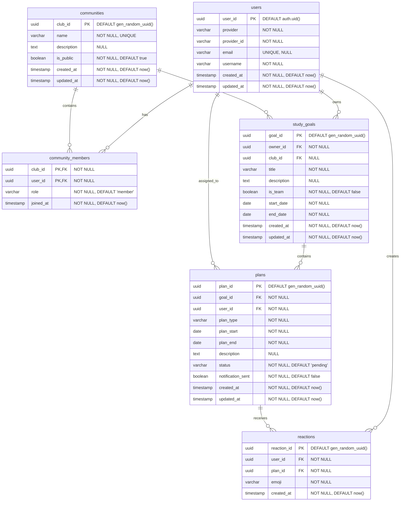

# 데이터 모델 (ERD & 스키마)

## ERD



## 데이터 스키마 테이블

### User 테이블 (소셜 로그인 전용)

| 컬럼명      | 타입      | 제약조건                | 설명                                         |
| ----------- | --------- | ----------------------- | -------------------------------------------- |
| user_id     | uuid      | PK, DEFAULT auth.uid()  | 사용자 고유 ID                               |
| provider    | VARCHAR   | NOT NULL                | 소셜 로그인 공급자명 (예: 'kakao', 'google') |
| provider_id | VARCHAR   | NOT NULL                | 소셜 로그인 공급자에서 발급한 고유 사용자 ID |
| email       | VARCHAR   | UNIQUE, NULL            | 이메일 (소셜 공급자가 제공 시)               |
| username    | VARCHAR   | NOT NULL                | 사용자명 (필요)                              |
| created_at  | TIMESTAMP | NOT NULL, DEFAULT now() | 생성일                                       |
| updated_at  | TIMESTAMP | NOT NULL, DEFAULT now() | 수정일 (트리거로 자동 업데이트)              |

#### 제약조건 - User 테이블

```sql
CONSTRAINT uk_user_provider UNIQUE (provider, provider_id)
CONSTRAINT uk_user_email UNIQUE (email)
```

#### 인덱스 - User 테이블

```sql
CREATE INDEX idx_user_provider ON users (provider, provider_id);
CREATE INDEX idx_user_email ON users (email);
```

### StudyGoal 테이블

| 컬럼명      | 타입      | 제약조건                     | 설명                             |
| ----------- | --------- | ---------------------------- | -------------------------------  |
| goal_id     | uuid      | PK DEFAULT gen_random_uuid() | 목표 고유 ID                     |
| owner_id    | uuid      | NOT NULL, FK(User.user_id)   | 목표 소유자 (개인 또는 팀 리더)  |
| club_id     | uuid      | NULL, FK(Community.club_id)  | 연결된 커뮤니티 (팀 목표인 경우) |
| title       | VARCHAR   | NOT NULL                     | 목표명                           |
| description | TEXT      | NULL                         | 목표 설명                        |
| is_team     | BOOLEAN   | NOT NULL, DEFAULT false      | 팀 목표 여부                     |
| start_date  | DATE      | NOT NULL                     | 목표 시작일                      |
| end_date    | DATE      | NOT NULL                     | 목표 종료일                      |
| created_at  | TIMESTAMP | NOT NULL, DEFAULT now()      | 생성일                           |
| updated_at  | TIMESTAMP | NOT NULL, DEFAULT now()      | 수정일 (트리거로 자동 업데이트)  |

#### 제약조건 - StudyGoal 테이블

```sql
CONSTRAINT chk_goal_dates CHECK (end_date >= start_date)
CONSTRAINT fk_goal_owner FOREIGN KEY (owner_id) REFERENCES users(user_id) ON DELETE CASCADE
CONSTRAINT chk_team_goal_club CHECK (
    (is_team = false AND club_id IS NULL) OR 
    (is_team = true AND club_id IS NOT NULL)
)
```

#### 인덱스 - StudyGoal 테이블

```sql
CREATE INDEX idx_goal_owner ON study_goals (owner_id);
CREATE INDEX idx_goal_dates ON study_goals (start_date, end_date);
CREATE INDEX idx_goal_team ON study_goals (is_team);
```

### Plan 테이블

| 컬럼명            | 타입      | 제약조건                       | 설명                                              |
| ----------------- | --------- | ------------------------------ | ------------------------------------------------- |
| plan_id           | uuid      | PK DEFAULT gen_random_uuid()   | 계획 고유 ID                                      |
| goal_id           | uuid      | FK(StudyGoal.goal_id) NOT NULL | 연결된 목표 ID                                    |
| user_id           | uuid      | FK(User.user_id) NOT NULL      | 담당자 (팀원의 경우 개별 관리 가능)               |
| plan_type         | VARCHAR   | NOT NULL                       | 계획 유형 ('weekly', 'daily')                     |
| plan_start        | DATE      | NOT NULL                       | 계획 시작일                                       |
| plan_end          | DATE      | NOT NULL                       | 계획 종료일                                       |
| description       | TEXT      | NULL                           | 계획 내용                                         |
| status            | VARCHAR   | NOT NULL, DEFAULT 'pending'    | 진행 상태 ('pending', 'in_progress', 'completed') |
| notification_sent | BOOLEAN   | NOT NULL, DEFAULT false        | 알림 발송 여부                                    |
| created_at        | TIMESTAMP | NOT NULL, DEFAULT now()        | 생성일                                            |
| updated_at        | TIMESTAMP | NOT NULL, DEFAULT now()        | 수정일 (트리거로 자동 업데이트)                   |

#### 제약조건 - Plan 테이블

```sql
CONSTRAINT chk_plan_dates CHECK (plan_end >= plan_start)
CONSTRAINT chk_plan_type CHECK (plan_type IN ('weekly', 'daily'))
CONSTRAINT chk_plan_status CHECK (status IN ('pending', 'in_progress', 'completed'))
CONSTRAINT fk_plan_goal FOREIGN KEY (goal_id) REFERENCES study_goals(goal_id) ON DELETE CASCADE
CONSTRAINT fk_plan_user FOREIGN KEY (user_id) REFERENCES users(user_id) ON DELETE CASCADE
```

#### 인덱스 - Plan 테이블

```sql
CREATE INDEX idx_plan_goal ON plans (goal_id);
CREATE INDEX idx_plan_user ON plans (user_id);
CREATE INDEX idx_plan_dates ON plans (plan_start, plan_end);
CREATE INDEX idx_plan_status ON plans (status);
```

### Reaction 테이블

| 컬럼명      | 타입      | 제약조건                     | 설명                                |
| ----------- | --------- | ---------------------------- | ----------------------------------  |
| reaction_id | uuid      | PK DEFAULT gen_random_uuid() | 리액션 고유 ID                      |
| user_id     | uuid      | NOT NULL, FK(users.user_id)  | 반응 누른 사용자 ID                 |
| plan_id     | uuid      | NOT NULL, FK(plans.plan_id)  | 대상 계획 ID                        |
| emoji       | VARCHAR   | NOT NULL                     | 이모지 코드 또는 이름 (예: 👍, ❤️) |
| created_at  | TIMESTAMP | NOT NULL, DEFAULT now()      | 반응 누른 시간                      |

#### 제약조건 - Reaction 테이블

```sql
CONSTRAINT uk_reaction_user_plan UNIQUE (user_id, plan_id, emoji)
CONSTRAINT fk_reaction_user FOREIGN KEY (user_id) REFERENCES users(user_id) ON DELETE CASCADE
CONSTRAINT fk_reaction_plan FOREIGN KEY (plan_id) REFERENCES plans(plan_id) ON DELETE CASCADE
```

#### 인덱스 - Reaction 테이블

```sql
CREATE INDEX idx_reaction_plan ON reactions (plan_id);
CREATE INDEX idx_reaction_user ON reactions (user_id);
```

### Community 테이블

| 컬럼명      | 타입      | 제약조건                     | 설명                            |
| ----------- | --------- | ---------------------------- | ------------------------------- |
| club_id     | uuid      | PK DEFAULT gen_random_uuid() | 클럽 고유 ID                    |
| name        | VARCHAR   | NOT NULL, UNIQUE             | 클럽 이름                       |
| description | TEXT      | NULL                         | 클럽 소개                       |
| is_public   | BOOLEAN   | NOT NULL, DEFAULT true       | 공개 여부                       |
| created_at  | TIMESTAMP | NOT NULL, DEFAULT now()      | 생성일                          |
| updated_at  | TIMESTAMP | NOT NULL, DEFAULT now()      | 수정일 (트리거로 자동 업데이트) |

#### 제약조건 - Community 테이블

```sql
CONSTRAINT uk_community_name UNIQUE (name)
```

#### 인덱스 - Community 테이블

```sql
CREATE INDEX idx_community_public ON communities (is_public);
CREATE INDEX idx_community_name ON communities (name);
```

### CommunityMember 테이블

| 컬럼명    | 타입      | 제약조건                           | 설명                     |
| --------- | --------- | ---------------------------------- | ------------------------ |
| club_id   | uuid      | NOT NULL, FK(communities.club_id)  | 소속 클럽 ID             |
| user_id   | uuid      | NOT NULL, FK(users.user_id)        | 회원 ID                  |
| role      | VARCHAR   | NOT NULL, DEFAULT 'member'         | 역할 ('admin', 'member') |
| joined_at | TIMESTAMP | NOT NULL, DEFAULT now()            | 가입일                   |

#### 제약조건 - CommunityMember 테이블

```sql
CONSTRAINT pk_community_member PRIMARY KEY (club_id, user_id)
CONSTRAINT fk_member_club FOREIGN KEY (club_id) REFERENCES communities(club_id) ON DELETE CASCADE
CONSTRAINT fk_member_user FOREIGN KEY (user_id) REFERENCES users(user_id) ON DELETE CASCADE
CONSTRAINT chk_member_role CHECK (role IN ('admin', 'member'))
```

#### 인덱스 - CommunityMember 테이블

```sql
CREATE INDEX idx_member_user ON community_members (user_id);
CREATE INDEX idx_member_club ON community_members (club_id);
```
