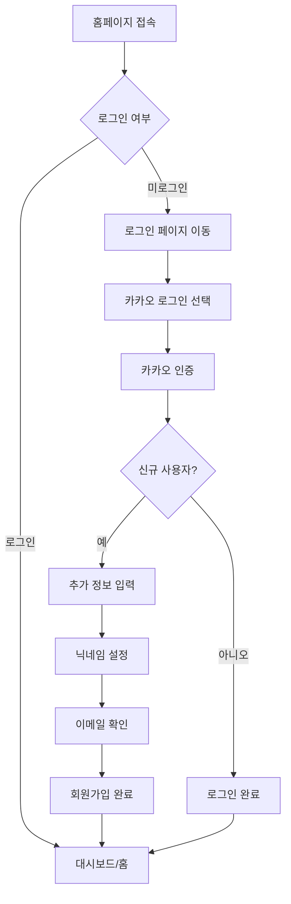
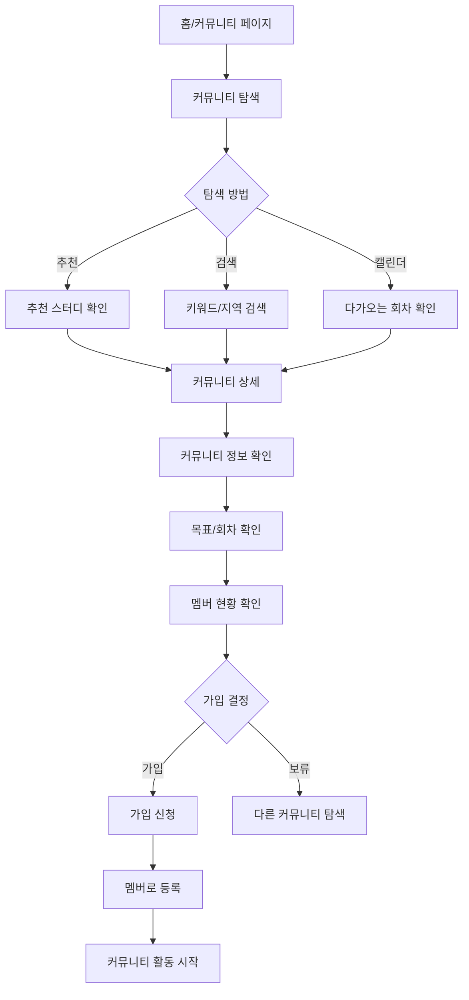
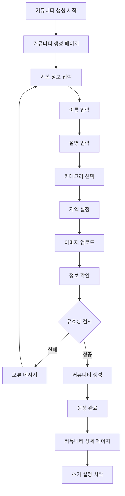
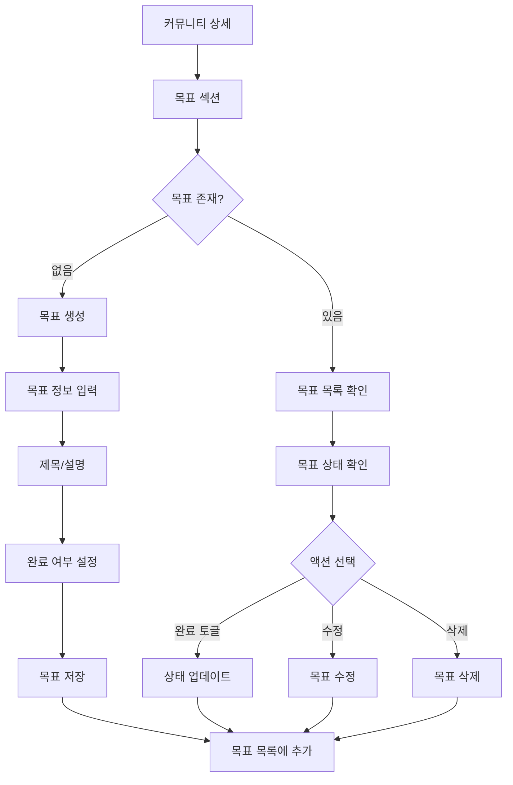
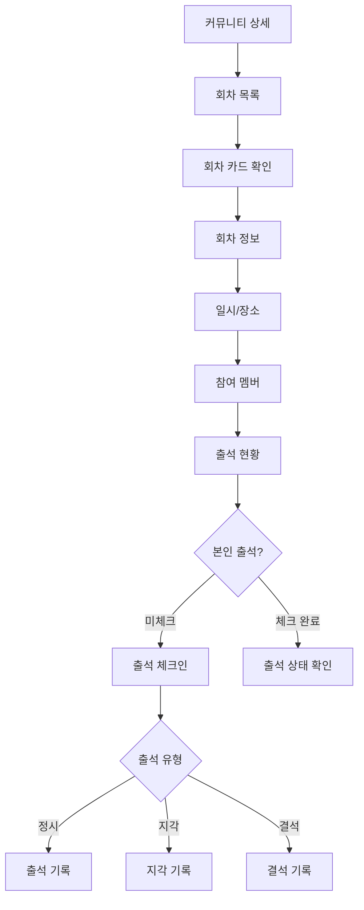
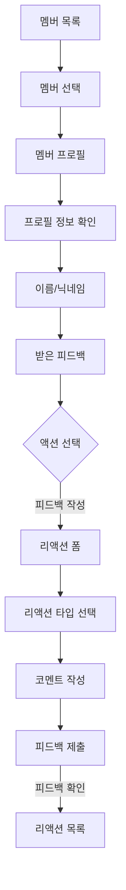
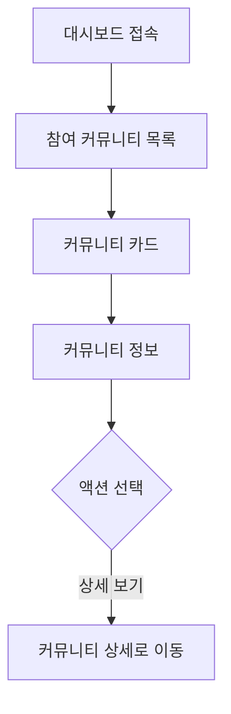
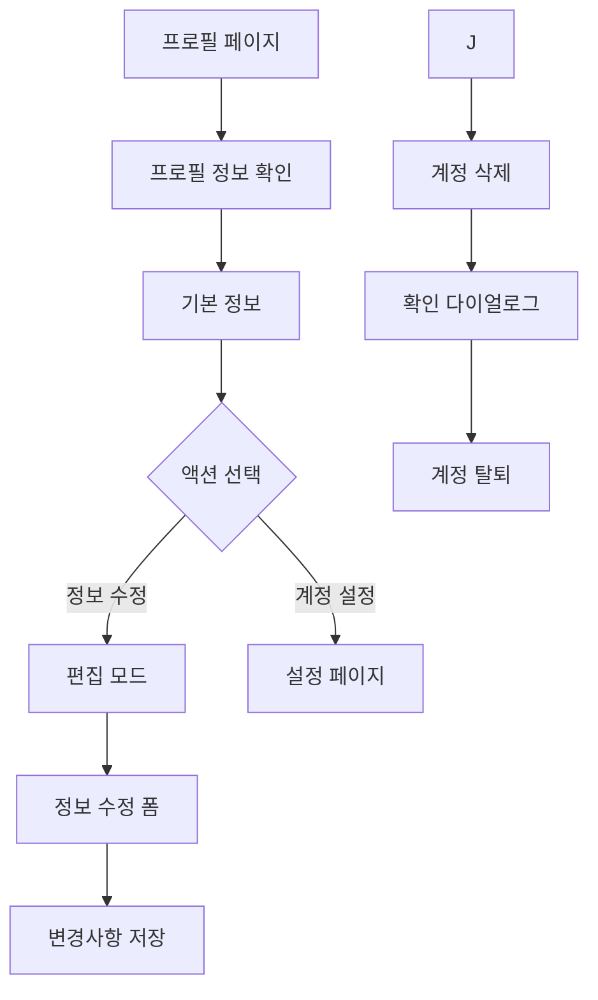

# 주요 사용자 플로우

> 토끼노트의 핵심 기능별 사용자 여정을 단계별로 설명합니다.

---

## 1. 회원가입 및 로그인

### 목적

서비스를 이용하기 위한 계정 생성 및 인증

### 시작점

- 홈페이지 (`/`) 방문
- 로그인 페이지 (`/login`) 직접 접근

### 플로우



### 상세 단계

#### 1.1 카카오 소셜 로그인

```
1. 로그인 페이지 접속
2. "카카오로 시작하기" 버튼 클릭
3. 카카오 인증 페이지로 리다이렉트
4. 카카오 계정 로그인 (미로그인 시)
5. 서비스 권한 동의
6. 토끼노트로 리다이렉트
```

**API 흐름**:

- `GET /api/login-kakao/start` - 카카오 인증 시작
- `GET /api/login-kakao/callback` - 카카오 인증 콜백
- `GET /api/login-kakao/check-username` - 중복 확인
- `POST /api/login-kakao/register` - 회원가입 완료

#### 1.2 신규 사용자 등록

```
1. 카카오 인증 완료 후 자동으로 회원가입 페이지로 이동
2. 닉네임 입력 (중복 확인)
3. 사용자명 입력 (중복 확인)
4. 이메일 확인 (카카오에서 자동 가져옴)
5. "가입하기" 버튼 클릭
6. 홈페이지로 자동 리다이렉트
```

### 완료 상태

- NextAuth 세션 생성
- 사용자 정보 데이터베이스 저장
- 메인 페이지 또는 대시보드로 이동

---

## 2. 커뮤니티 탐색 및 가입

### 목적

관심 있는 스터디 커뮤니티를 찾고 참여하기

### 시작점

- 홈페이지 (`/`)
- 커뮤니티 목록 페이지 (`/community`)
- 검색 페이지 (`/search`)

### 플로우



### 상세 단계

#### 2.1 홈페이지에서 탐색

```
1. 홈페이지 접속
2. "추천 스터디" 섹션 확인
3. 관심 커뮤니티 클릭
4. 상세 페이지로 이동
```

#### 2.2 검색을 통한 탐색

```
1. 검색 페이지 접속 (/search)
2. 검색 방법 선택:

   A) 키워드 검색
   - 검색어 입력 (예: "React", "알고리즘")
   - 검색 결과 확인

   B) 지역 검색
   - 시/도 선택
   - 시/군/구 선택
   - 해당 지역 커뮤니티 목록 확인

   C) 필터 조합
   - 키워드 + 지역
   - 모집 상태 필터

3. 검색 결과에서 커뮤니티 선택
```

**API 흐름**:

- `GET /api/search?query=keyword&region=서울` - 키워드/지역 검색
- `GET /api/communities` - 전체 커뮤니티 목록
- `GET /api/region` - 지역 데이터 조회

#### 2.3 커뮤니티 상세 확인

```
1. 커뮤니티 상세 페이지 접속 (/community/[id])
2. 정보 확인:
   - 커뮤니티 소개
   - 예정된 회차 일정
   - 참여 멤버 수
   - 커뮤니티 이미지
   - 지역 정보
3. "가입하기" 버튼 클릭
4. 멤버로 등록 완료
```

**API 흐름**:

- `GET /api/communities/[id]` - 커뮤니티 상세 정보
- `GET /api/goals?communityId=[id]` - 커뮤니티 목표 목록
- `GET /api/rounds?communityId=[id]` - 회차 일정
- `POST /api/members` - 멤버 가입

---

## 3. 스터디 커뮤니티 생성

### 목적

새로운 스터디 그룹을 만들어 운영하기

### 시작점

- 커뮤니티 목록 페이지 (`/community`)
- "새 커뮤니티 만들기" 버튼

### 플로우



### 상세 단계

#### 3.1 커뮤니티 생성 폼 작성

```
1. "새 커뮤니티 만들기" 페이지 접속 (/community/new)
2. 필수 정보 입력:

   [기본 정보]
   - 커뮤니티 이름
   - 상세 설명
   - 태그

   [위치 정보]
   - 시/도 선택
   - 시/군/구 선택

   [이미지]
   - 대표 이미지 업로드 (선택)
   - 지원 형식: JPG, PNG, WEBP
   - 최대 크기: 5MB

3. 입력 완료 후 "생성하기" 버튼 클릭
```

**유효성 검사**:

- 이름: 2-50자
- 설명: 10-500자
- 지역: 필수 선택

#### 3.2 커뮤니티 생성 완료

```
1. 생성 완료 메시지 확인
2. 자동으로 커뮤니티 상세 페이지로 이동
3. 관리자 권한 자동 부여
4. 다음 단계 안내:
   - 첫 목표 설정하기
   - 첫 회차 생성하기
```

**API 흐름**:

- `POST /api/upload/image` - 이미지 업로드
- `POST /api/communities` - 커뮤니티 생성
- `POST /api/members` - 생성자를 관리자로 등록

---

## 4. 목표 설정 및 관리

### 목적

커뮤니티 또는 개인의 학습 목표를 설정하고 추적하기

### 시작점

- 커뮤니티 상세 페이지 (`/community/[id]`)
- "목표" 섹션

### 플로우



### 상세 단계

#### 4.1 목표 생성

```
1. 커뮤니티 상세 페이지에서 "목표 추가" 클릭
2. 목표 정보 입력:
   - 목표 제목 (필수)
   - 상세 설명
   - 완료 여부 (기본: 미완료)
3. "저장" 버튼 클릭
4. 목표 목록에 즉시 반영
```

**권한**:

- 커뮤니티 관리자: 생성, 수정, 삭제 가능
- 일반 멤버: 공통 목표는 조회만 가능, 개인 목표는 생성, 수정, 삭제 가능

#### 4.2 목표 관리

```
1. 목표 목록에서 특정 목표 선택
2. 가능한 액션:

   A) 완료 체크박스 토글
   - 체크: 완료 상태로 변경
   - 해제: 진행 중 상태로 변경

   B) 수정 (관리자만)
   - 목표 제목/설명 수정
   - "저장" 클릭

   C) 삭제 (관리자만)
   - "삭제" 버튼 클릭
   - 확인 다이얼로그
   - 삭제 완료

3. 변경사항 즉시 반영
```

**API 흐름**:

- `POST /api/goals` - 목표 생성
- `GET /api/goals?communityId=[id]` - 목표 목록 조회
- `PATCH /api/goals/[id]` - 목표 수정
- `DELETE /api/goals/[id]` - 목표 삭제

---

## 5. 회차 참여 및 출석

### 목적

정기 모임(회차)에 참여하고 출석을 기록하기

### 시작점

- 커뮤니티 상세 페이지 (`/community/[id]`)
- "회차" 섹션

### 플로우



### 상세 단계

#### 5.1 회차 정보 확인

```
1. 커뮤니티 상세 페이지의 "회차" 섹션으로 스크롤
2. 회차 카드 목록 확인:
   - 회차 수
   - 일시 (날짜/시간)
   - 장소 (온라인/오프라인)
   - 참여 멤버 수

3. 특정 회차 카드 클릭하여 상세 확인
```

#### 5.2 출석 체크

```
1. 회차 시작 시간 전후로 출석 가능
2. 본인의 출석 상태 확인
3. 출석 유형 선택:
   - 출석 (정시 도착)
   - 지각 (늦게 도착)
   - 결석 (불참)

4. 출석 체크 버튼 클릭
5. 출석 기록 즉시 반영
```

**출석 규칙**:

- 회차 시작 전: 출석 예정으로 표시
- 회차 진행 중: 실시간 출석 체크 가능
- 회차 종료 후: 출석 기록 확정

**API 흐름**:

- `GET /api/rounds?communityId=[id]` - 회차 목록
- `GET /api/rounds/[id]` - 회차 상세
- `GET /api/attendance/round/[roundId]` - 회차별 출석 현황
- `POST /api/attendance` - 출석 체크
- `PATCH /api/attendance/[id]` - 출석 상태 수정
- `GET /api/attendance/user/[userId]` - 사용자별 출석 기록

---

## 6. 멤버 프로필 및 피드백

### 목적

커뮤니티 멤버의 프로필을 확인하고 피드백 주고받기

### 시작점

- 커뮤니티 멤버 목록 (`/community/member/[id]`)
- 멤버 프로필 페이지 (`/community/member-profile/[id]`)

### 플로우



### 상세 단계

#### 6.1 멤버 목록 탐색

```
1. 커뮤니티 멤버 페이지 접속
2. 검색 기능 활용:
   - 이름으로 검색
   - 닉네임으로 검색
   - 이메일로 검색

3. 멤버 카드 확인:
   - 프로필 이미지
   - 이름
   - 참여 상태

4. 멤버 카드 클릭
```

#### 6.2 멤버 프로필 상세

```
1. 멤버 프로필 페이지 로드
2. 정보 확인:

   [기본 정보]
   - 프로필 이미지
   - 닉네임
   - 가입일

   [활동 정보]
   - 참여 중인 커뮤니티
   - 참여한 회차 수

   [피드백]
   - 받은 리액션 목록

3. 하단으로 스크롤하여 피드백 섹션 확인
```

#### 6.3 피드백(리액션) 작성

```
1. "피드백 작성" 버튼 클릭
2. 리액션 폼 표시
3. 입력 사항:
   [코멘트 작성] (필수)
   - 최소 10자
   - 최대 500자
   - 구체적이고 건설적인 피드백 작성

4. "제출" 버튼 클릭
5. 리액션 목록에 즉시 추가
6. 대상 멤버에게 알림 발송
```

**API 흐름**:

- `GET /api/members?communityId=[id]` - 멤버 목록
- `GET /api/members/[id]` - 멤버 상세 정보
- `POST /api/reactions` - 리액션 생성
- `GET /api/reactions/member/[memberId]` - 멤버가 받은 리액션
- `GET /api/reactions/user/[userId]` - 사용자가 작성한 리액션

---

## 7. 대시보드 활용

### 목적

참여 중인 모든 커뮤니티를 한눈에 확인하고 관리하기

### 시작점

- 대시보드 페이지 (`/dashboard`)
- 헤더의 "대시보드" 메뉴

### 플로우



### 상세 단계

#### 7.1 대시보드 개요

```
1. 대시보드 페이지 로드
2. 커뮤니티 카드 목록 스크롤
```

#### 7.2 커뮤니티 카드

```
각 커뮤니티 카드에 표시되는 정보:

[기본 정보]
- 커뮤니티 이름
- 커뮤니티 이미지
- 역할 (관리자/멤버)

[빠른 액션]
- "상세 보기" 버튼
```

#### 7.3 커뮤니티 상세

```
1. 커뮤니티 상세 페이지 로드
2. 커뮤니티 정보 확인
3. 목표 목록 확인
4. 멤버 목록 확인
```

---

## 8. 프로필 관리

### 목적

개인 정보 및 계정 설정 관리

### 시작점

- 프로필 페이지 (`/profile`)
- 헤더의 프로필 아이콘/이름

### 플로우



### 상세 단계

#### 8.1 프로필 정보 확인

```
1. 프로필 페이지 접속
2. 정보 확인:

   [기본 정보]
   - 이름
   - 닉네임
   - 이메일
```

#### 8.2 프로필 수정

```
1. "프로필 수정" 버튼 클릭
2. 편집 모드 활성화
3. 수정 가능한 항목:
   - 이름
   - 닉네임 (중복 확인)

4. 변경사항 입력
5. "저장" 버튼 클릭
6. 유효성 검사
7. 프로필 업데이트 완료
```

**유효성 검사**:

- 이름: 2-50자
- 닉네임: 2-20자, 중복 불가

#### 8.3 계정 삭제

```
1. "계정 삭제" 버튼 클릭
2. 경고 다이얼로그 표시:
   - 삭제 시 복구 불가능
   - 모든 데이터 영구 삭제
   - 참여 중인 커뮤니티에서 자동 탈퇴

3. 확인을 위한 입력 요구:
   - "DELETE" 문자열 입력
   - 또는 비밀번호 재확인

4. "최종 삭제" 버튼 클릭
5. 계정 삭제 처리:
   - 사용자 데이터 삭제
   - 세션 종료
   - 로그인 페이지로 리다이렉트
```

**API 흐름**:

- `GET /api/user` - 사용자 정보 조회
- `PATCH /api/user` - 사용자 정보 수정
- `DELETE /api/profile/delete` - 계정 삭제

---

## 사용자 여정 요약

### 신규 사용자 (첫 방문)

```
1. 홈페이지 접속
2. 카카오 로그인
3. 회원가입 완료
4. 추천 커뮤니티 탐색
5. 관심 커뮤니티 가입
6. 첫 회차 참여 및 출석
```

### 일반 사용자 (정기 방문)

```
1. 로그인
2. 대시보드 확인
3. 오늘의 회차 출석 체크
4. 멤버에게 피드백 작성
5. 진행 중인 목표 상태 확인
```

### 커뮤니티 관리자

```
1. 로그인
2. 커뮤니티 상세 페이지 접속
3. 새로운 목표 생성
4. 다음 회차 일정 등록
5. 멤버 출석 현황 확인
6. 공지사항 작성
7. 커뮤니티 정보 업데이트
```

---

## 주요 페이지 맵

```
/                              → 홈페이지
/login                         → 로그인
/dashboard                     → 대시보드
/community                     → 커뮤니티 목록
/community/new                 → 커뮤니티 생성
/community/[id]                → 커뮤니티 상세
/community/member/[id]         → 멤버 목록
/community/member-profile/[id] → 멤버 프로필
/community/notification/[id]   → 알림 상세
/search                        → 검색
/notifications                 → 알림 목록
/profile                       → 내 프로필
```
